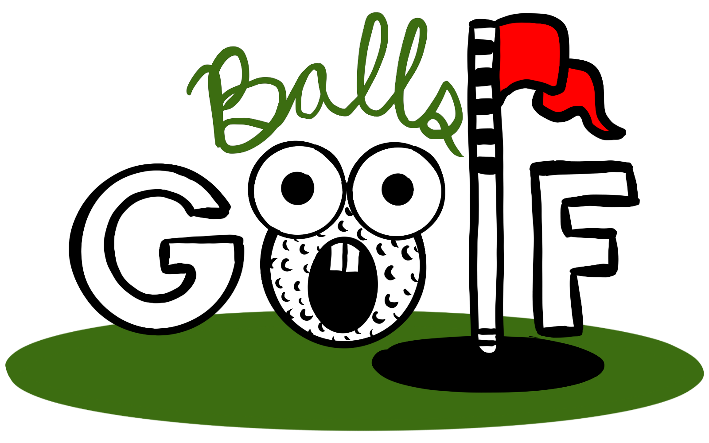
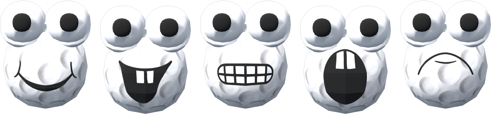

<p align="center">
  
</p>

<p align="center">
  <em><strong>Be the Ball.</strong></em>
</p>

<p align="center">
  
</p>

Balls Golf is built with **[Babylon.js](https://www.babylonjs.com/)** and the **Havok** physics engine. Become a golf ball.Swipe to launch yourself down the fairway, add spin, sink the putt. Bond and hang out with with other balls at the clubhouse.

---

## Where you can go

The clubhouse is the hub. Walk up to a door and step through it to travel between places.

| Place                | Page                      | What it is                                                                                                                                                                             |
| -------------------- | ------------------------- | -------------------------------------------------------------------------------------------------------------------------------------------------------------------------------------- |
| 🏛️ **Clubhouse**     | `index.html`              | The root — a Club-Penguin-style country-club lounge (PS1 wood + dark-green shag). Walk around, chat, grab a beer or a smoke, and pick a door. Includes a **Members Lounge** back room. |
| ⛳ **The Course**    | `game.html?mode=course`   | Three hand-authored holes played as match play, with drone fly-overs between holes, real cavity cups, and a randomized pin each round.                                                 |
| 🏌️ **Driving Range** | `game.html?mode=practice` | The original open sandbox — hit as many as you like at random pins, adjust the wind, dial in your clubs.                                                                               |
| 🎨 **Locker Room**   | `locker.html`             | A KidPix-style avatar editor: pick a hat, paint the ball skin, draw a face, or drop in a photo to stamp on your ball.                                                                  |

## How to play

**On the course / range**

- **Swipe to hit** — click-drag (or touch-drag) on the ball. Short drag = soft, long drag = hard.
- **Drag further for spin** — a spin bar appears; the extra distance becomes spin that curves and checks the shot.
- **Club carousel** — tap the clubs in the bottom-right corner to cycle your bag, from **Putter** all the way up to **Driver** (13 clubs, real-world carry distances).
- **Wind** — the top-right compass shows wind direction and strength; it nudges the ball in flight (adjustable on the range, fixed per hole on the course).
- **Space** — reset your ball (practice mode).

**In the clubhouse**

- **WASD** or the on-screen **joystick** to walk around.
- **Tap a dispenser** (cigarette machine / beer conveyor) to grab an item, then use the action buttons to sip or take a drag.
- **Chat** from the box in the top-left — messages pop up as speech bubbles over your ball.

## Running it locally

```bash
npm install   # also vendors the Babylon + Havok runtime into babylon/
npm start     # serves the clubhouse at http://localhost:3000
```

Open **http://localhost:3000** — you'll land in the clubhouse. The doors link to `game.html?mode=course|practice` and `locker.html`, so everything is reachable from there. (Opening `game.html` on its own drops you straight into the driving range.)

No Node? Any static file server works, e.g.:

```bash
python -m http.server 8000   # then open http://localhost:8000
```

## Multiplayer

Presence and chat in the clubhouse are powered by an **optional** companion realtime server (`drawvidverse`, run separately). When it's connected, you see other balls walk, chat, and show off their hats, skins, drawn faces, held drinks, and smokes — all synced live. When it isn't, the clubhouse still runs fine as single-player (your own chat is echoed locally), and the golf modes never need it.

## Project structure

```
index.html            Clubhouse — the hub (root page)
game.html             Golf — ?mode=course | practice
locker.html           Locker Room — avatar editor
server.js             Tiny Express static server (caches assets + babylon aggressively)

src/
  clubhouse/           clubhouse.js — the multiplayer lounge
  game/                Per-system golf modules: scene, physics, camera, input,
                       aim, clubs, course, terrain, birds, clouds, wind, ui, config…
  locker/              locker.js — the avatar editor
  shared/              shared.js, balls.js, materials.js, style.js
                       (loaded by every page before its mode script)

assets/               3D models (.glb), textures, ball faces, art, and the logo
course_design/        Blender authoring scripts (local, git-ignored — see below)
scripts/              vendor-babylon.js + puppeteer club-distance tooling
babylon/              Vendored Babylon.js + Havok runtime
test/                 node --test unit tests
```

The three pages are independent Babylon apps that share a common set of small modules in `src/shared/` (math helpers, ball blinking/faces, materials, and the `BallsStyle` customization module). No bundler — pages load plain `<script>`s in order.

## The authoring pipeline

The committed `.glb` models are produced from a set of **Blender** scripts under `course_design/` (kept locally — the directory is git-ignored). Everything is modeled procedurally and exported geometry-only; the runtime assigns materials and physics by mesh name.

- `holes_build.py` + `hole_gen.py` — generate the three golf holes (heightfield terrain, greens, bunkers, water, solid-sided ground) into `assets/3d/holes/`.
- `clubhouse_build.py` — builds the clubhouse and Members Lounge rooms.
- `gen_sand.py` — procedural bunker sand texture.

The scripts run either through the Blender MCP add-on or headless:

```bash
/Applications/Blender.app/Contents/MacOS/Blender --background --python course_design/holes_build.py
```

> After rebuilding any `.glb`, bump the matching asset version (`HOLE_ASSET_VERSION` in `src/game`, `ASSET_V` in the clubhouse) — `/assets` is served with a one-year immutable cache.

## Development

```bash
npm test           # node --test unit tests (no install needed to run)
npm run lint       # ESLint 9 (flat config)
npm run format     # Prettier
npm run typecheck  # tsc --noEmit against jsconfig.json (checkJs)
npm run hooks      # install the repo pre-commit hook (.githooks)
```

Club carry distances are calibrated with a headless Puppeteer harness:

```bash
node scripts/club-distance-test.js   # measure carry per club in a real browser
node scripts/club-calibrate.js       # solve launch speeds for target distances
```

## Updating Babylon & Havok

The project **vendors** browser-ready runtime files into `babylon/` instead of loading from a CDN. When you change versions, update them together in `package.json` and re-vendor:

```bash
npm install            # runs vendor:babylon automatically
# or, without reinstalling:
npm run vendor:babylon
```

That copies `babylon.js`, `babylonjs.loaders.min.js`, `babylonjs.materials.min.js`, `HavokPhysics_umd.js`, and `HavokPhysics.wasm` out of `node_modules`. Keep the vendored files and the installed packages on the same version so they don't drift. (If a vendored file is missing, the pages fall back to the Babylon CDN.)

## Under the hood

- **Engine:** Babylon.js 9.4 · **Physics:** Havok
- **True 1:1 scale** — the ball is a real **42.7 mm** and the world is modeled in metres, so you genuinely feel golf-ball-sized. An anti-tunneling guard keeps the tiny ball from punching through the thin course terrain at driver speed.
- **13 clubs** with calibrated launch speeds, plus spin, wind, and rolling resistance so putts actually settle on the green.
- **Customization** rides across every mode — the hat, skin, and face you build in the locker room show up on your ball on the course and in the clubhouse.

---

<p align="center"><em>Built for fun. Now go be the ball.</em> ⛳</p>
